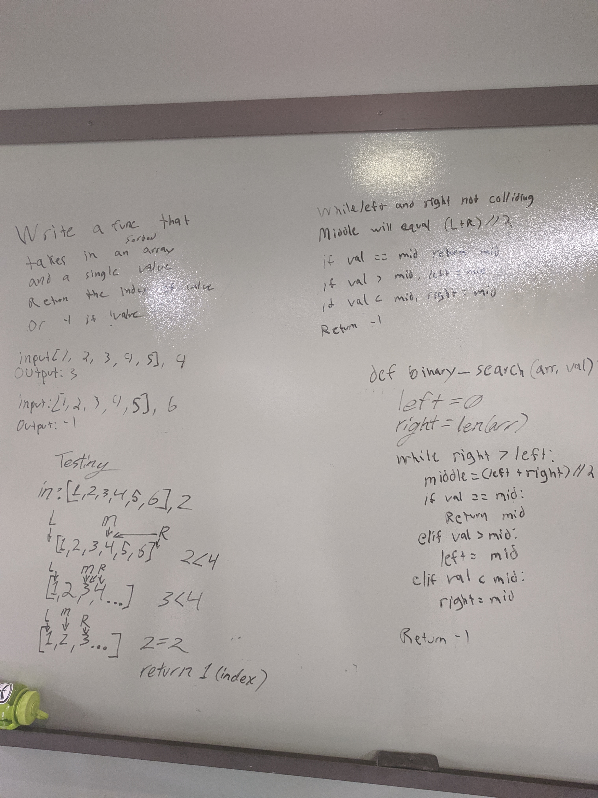

# Array Binary Search
[PR](https://github.com/401-Python/data-structures-and-algorithms/pull/4)  
[

## Feature Tasks
* Write a function called BinarySearch which takes in 2 parameters: a sorted array and the search key. Without utilizing any of the built-in methods available to your language, return the index of the array’s element that is equal to the search key, or -1 if the element does not exist.

## Implemntation
 * Check if val is present at mid of input array
 * If val is greater, ignore left half 
 * If x is smaller, ignore right half 

##Whiteboard

