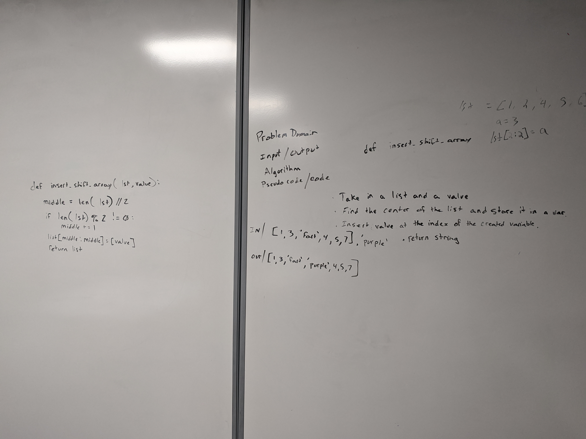

# Array Shift
[PR](https://github.com/401-Python/data-structures-and-algorithms/pull/2)  

## Feature Tasks
* Write a function called insertShiftArray which takes in an array and the value to be added. Without utilizing any of the built-in methods available to your language, return an array with the new value added at the middle index.

## Implemntation
  I accomplished this by creating a variable to refrence the middle index of the input list
  If the input list is an odd number, I increment the middle index by 1
  Finally I slice the input value into the list at the position of the middle index and return the list

##Whiteboard

