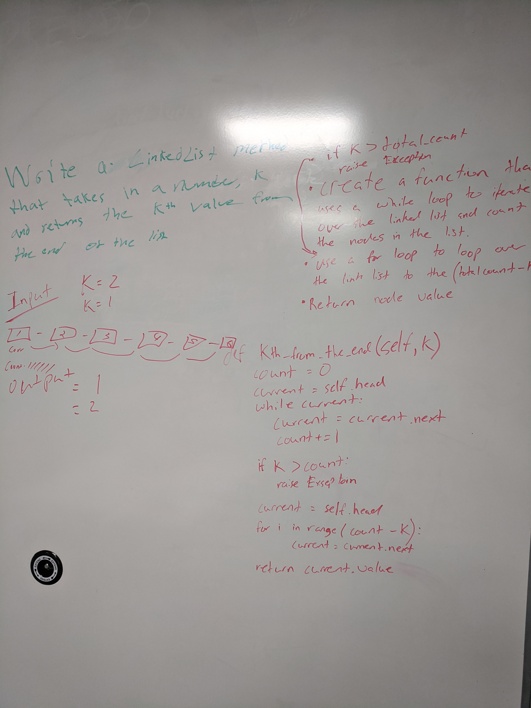

# Data Structures and Algorithms

### Author: Alvian Joseph

### Links and Resources
* [submission PR]()
* [

## Table of Contents

#### [Code Challenges]()
#### [Data Structures]()  

#### DSA Implementation
   * Create a Node class that has properties for the value stored and a pointer to the next node.
   * adds `includes()` method that checks if a `value` is included in a list and returns a boolean
   * adds `insert()` method that can add a new node with given data  
   
   
#### ll-insertions
  * adds `append()` method that takes in a value and adds it to the end of the list  
  * adds `insertBefore()` method that inserts a new value before an existing value in a list
  * adds `insertAfter()` method that inserts a new value after an existing value in a list

  

#### ll_kth_from_end
   * adds method for the Linked List class which takes a number, k, as a parameter. Return the node’s value that is k from the end of the linked list.

#### Running the app
* python

#### whiteboard

  
#### Tests
* How do you run tests?
  * `npm test`
  * `npm run lint`
